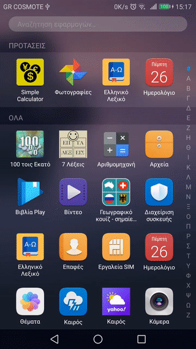

# SimpleCalculator (with currency exchange rates)

This app is a simple calculator with the ability to convert from one currency to another. Specifically, it uses the Fixer.io API to get current exchange rates for the 6 most traded currencies in the world (more could be added easily but it would become unwieldy). By default it caches the fetched exchange rates up to 1 hour, with an option to change that to 30', 15', 1' or even disable the cache altogether.

The app uses a ViewModel plus LiveData for the persistence of the data and BindingAdapters to ensure the layouts are in sync with the data. The ViewModel itself talks to the Repository, which is responsible for the caching and fetching of the data from the Internet. The Fixer.io api is accessed via Retrofit, with the addition of Moshi adapters for the easy (de)serialization of the received data.

Uhm, that's all I can think of..

NOTE: for the app to run one must have an api key from Fixer.io. My own key is not saved in the repo, I create it at build time to keep it secret. If you want to run the app, you must get your own key and put it in ~/.gradle/gradle.properties (cf stackoverflow)

Launcher icon made by [Freepik](https://www.flaticon.com/authors/freepik) from [www.flaticon.com](https://www.flaticon.com/).
